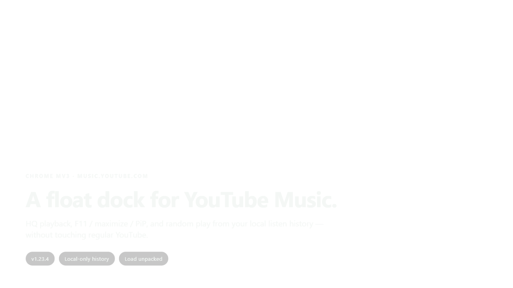
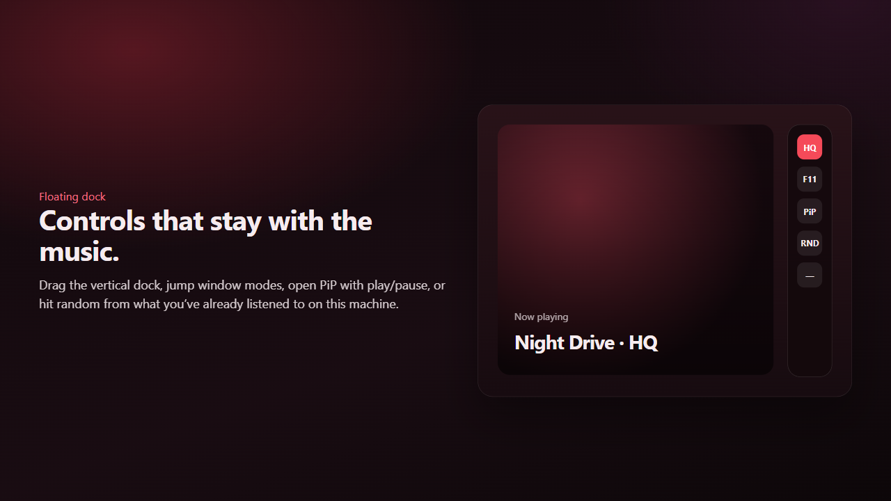
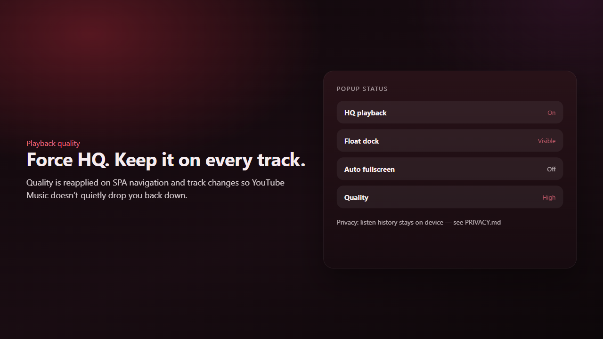
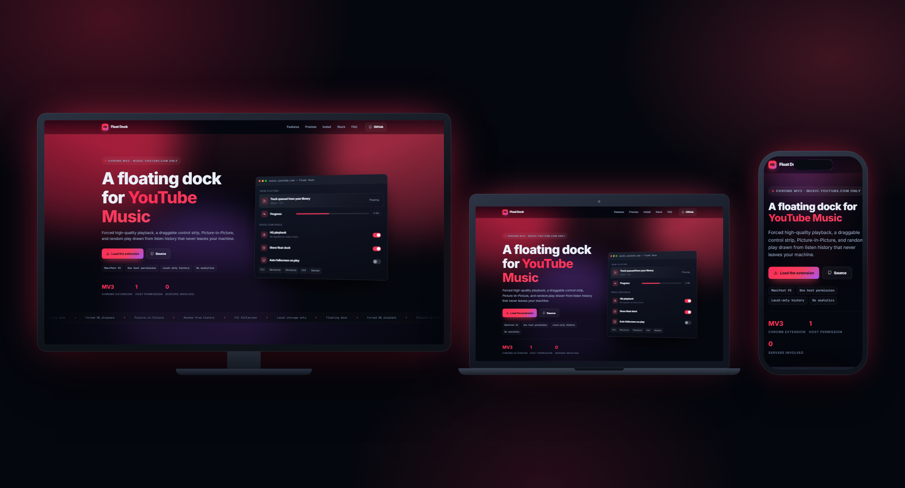
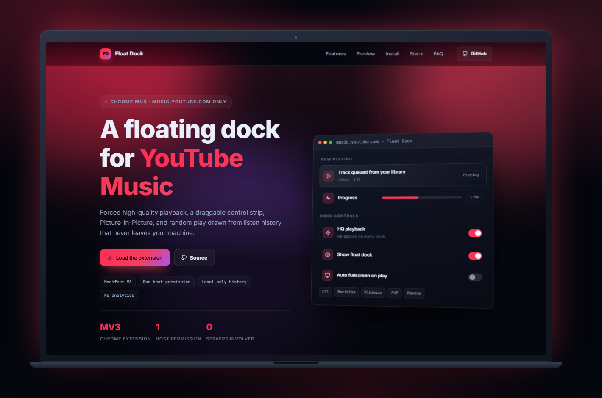
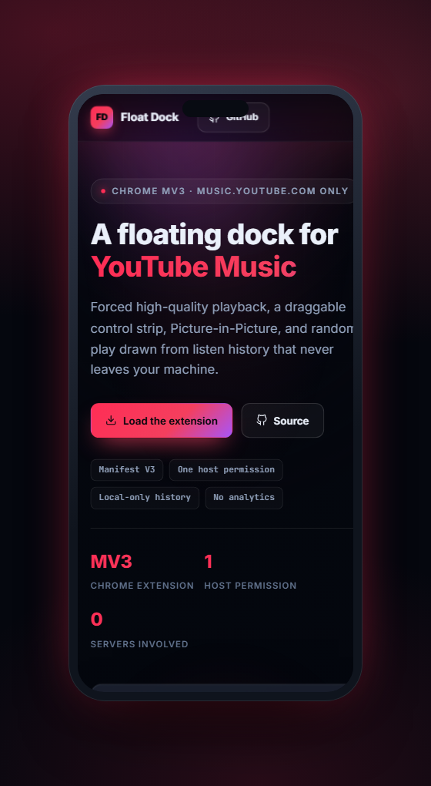
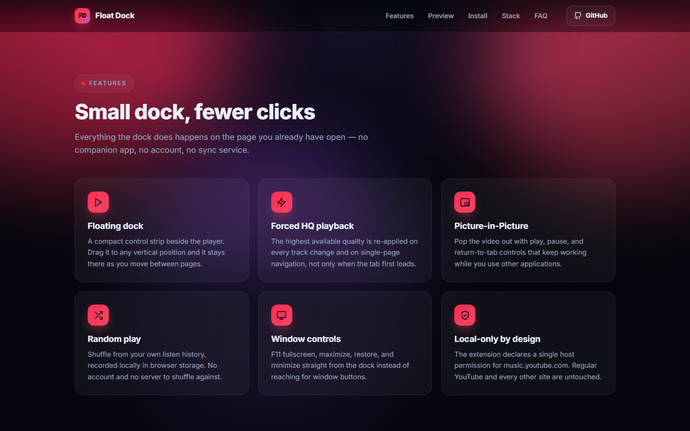
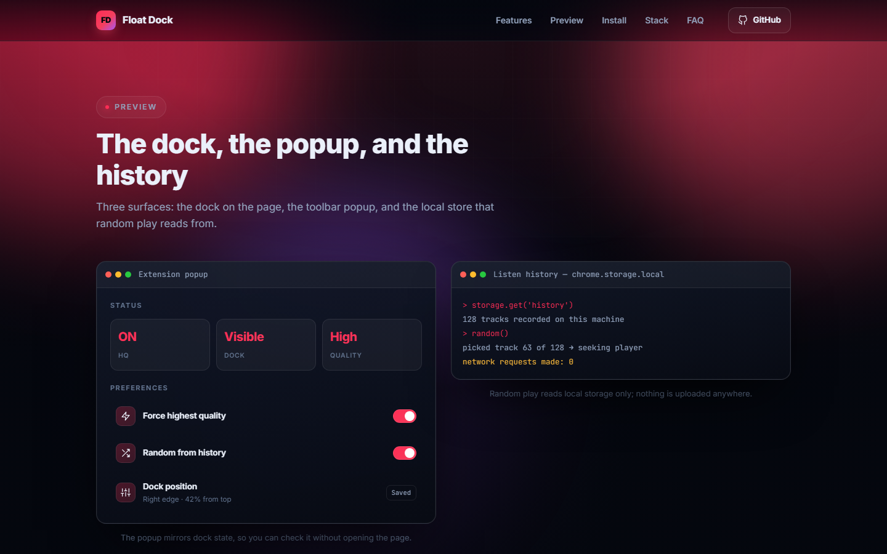
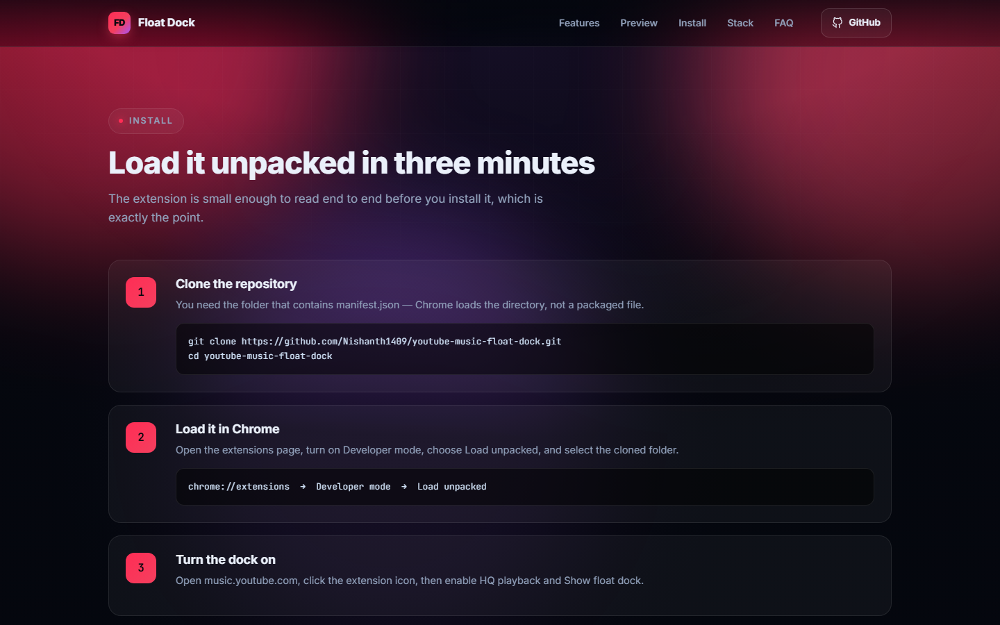

<div align="center">

# YouTube Music Float Dock

**A floating control dock for YouTube Music** — HQ playback, F11 / maximize / PiP, and random play from local listen history.

Chrome MV3 · `music.youtube.com` only · **v1.23.4**

[](https://developer.chrome.com/docs/extensions)
[](https://music.youtube.com)
[](PRIVACY.md)

[**Live site →**](https://nishanth1409.github.io/youtube-music-float-dock/)

</div>

<div align="center">
  
</div>

---

## Why this exists

YouTube Music is great until you want a small always-there control strip, forced HQ, or PiP without fighting the page. **Float Dock** is a Chrome extension that only runs on `music.youtube.com` — regular YouTube is never touched — and keeps listen history **on your machine**.

> Built by **Nishanth K R** — *son of a farmer, always a farmer.*

---

## What you can do

- **Floating dock** — drag vertical position; F11 / maximize / normal / minimize.
- **Picture-in-Picture** — play/pause and return-to-tab controls.
- **Random play** — from **local** listen history (no server).
- **Forced HQ playback** — reapplied on every track and SPA navigation.
- **Popup controls** — HQ, dock visibility, auto-fullscreen, dock position, now-playing status.
- **Local-only privacy** — see [`PRIVACY.md`](PRIVACY.md).

---

## Preview

<div align="center">
  
  <p><em>Floating dock beside the player — HQ, F11, PiP, random.</em></p>
</div>

<div align="center">
  
  <p><em>Popup status — HQ on, dock visible, quality high.</em></p>
</div>

---

## Tech stack

| Layer | Technology |
| --- | --- |
| Extension | Chrome Manifest V3 |
| Scripts | Content scripts (MAIN + isolated) · service worker · popup |
| APIs | `chrome.storage` · tabs · windows |
| Host | `https://music.youtube.com/*` only |

---

## Getting started

### 1. Clone

```bash
git clone https://github.com/Nishanth1409/youtube-music-float-dock.git
cd youtube-music-float-dock
```

### 2. Load in Chrome

1. Open `chrome://extensions`  
2. Enable **Developer mode**  
3. **Load unpacked** → select **this repo folder** (the one with `manifest.json`)  
4. Open [https://music.youtube.com](https://music.youtube.com)  
5. Click the extension icon → turn on **HQ playback** and **Show float dock**  

### 3. After code changes

`chrome://extensions` → **Reload** on this extension → refresh the YouTube Music tab.

### Layout

```text
youtube-music-float-dock/
├── manifest.json
├── background.js
├── content.js
├── listen-history.js
├── float-random.js
├── popup/
├── styles/
├── icons/
├── PRIVACY.md
└── README.md
```

### Tips

- Use a dedicated Chrome profile or PWA window for YouTube Music if you also run heavy extensions elsewhere.  
- Random play needs some listen history first — play a few tracks, then try Random.

## License

Personal / portfolio use. Review before redistributing.

---

## Project site

A full walkthrough is published as a project site — the feature set, preview panels, and the
install guide, all on one page.

<div align="center">
  
  <p><em>The project site on television, laptop, and phone.</em></p>
</div>

| Laptop · 1440 × 900 | Phone · 390 × 844 |
| :---: | :---: |
|  |  |

<div align="center">
  
  <p><em>Every feature, one card at a time.</em></p>
</div>

<div align="center">
  
  <p><em>Preview panels — what it looks like in use.</em></p>
</div>

<div align="center">
  
  <p><em>The install guide, step by step.</em></p>
</div>

---

## Live & credits

| | |
| :--- | :--- |
| **Live** | [nishanth1409.github.io/youtube-music-float-dock](https://nishanth1409.github.io/youtube-music-float-dock/) |
| **Author** | [Nishanth K R](https://github.com/Nishanth1409) |
| **Repo** | [Nishanth1409/youtube-music-float-dock](https://github.com/Nishanth1409/youtube-music-float-dock) |
| **Portfolio** | [nkrportfolio.vercel.app](https://nkrportfolio.vercel.app) |

---

<div align="center">

*Son of a farmer · always a farmer.*

[GitHub](https://github.com/Nishanth1409) · [Portfolio](https://nkrportfolio.vercel.app)

</div>
